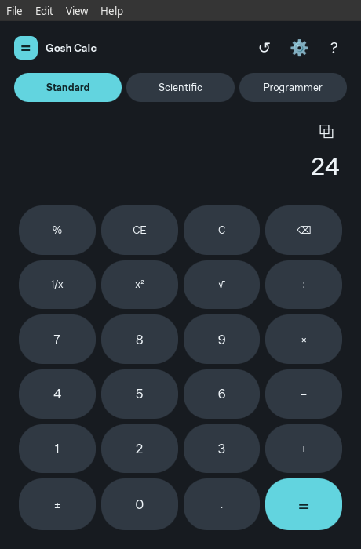

# Gosh Calc

A desktop calculator with standard, scientific and programmer modes, rebuilt
in Rust and Dioxus Desktop. It keeps Gosh Calc's keyboard workflow, pill keys,
cyan accent and calculation history.

**0.2.0-alpha.1 is a migration preview.** Linux native builds, X11/Wayland desktop
interaction, 200% scaling and the installed x86_64 Flatpak have been tested.
Windows/macOS desktop compilation checks pass; native runtime/installer checks
remain pending. Hosted CI is blocked by a GitHub billing lock; see
[PLATFORM_SUPPORT.md](PLATFORM_SUPPORT.md).
Do not treat this preview as a validated stable release on every platform.




Both images are captures of the running Linux application, not mockups.

## Features

- Standard arithmetic with precedence, repeat equals, contextual percent,
  reciprocal, square and square root.
- Scientific powers, roots, factorial, logarithms, exponentials, trigonometry,
  inverse trigonometry, DEG/RAD, π/e, EE and parentheses.
- Exact signed 64-bit programmer arithmetic, HEX/DEC/OCT/BIN conversion,
  bitwise operations and shifts. Invalid digits are disabled.
- Up to 100 persistent history entries, recall and copy result.
- Native menus, keyboard shortcuts, settings and About; System, Light and Dark
  themes; persistent window size and maximized state.
- Automatic import of the old Linux mode, angle and history with backups.

Unary functions act immediately on the current entry. Standard/scientific
calculations use `f64` and display about 12 significant digits; this is not a
symbolic or arbitrary-precision calculator. Programmer operations use `i64`.
English is the shipped interface language, as in version 0.1. The Linux WebKit
process tree currently uses more memory than the old app; measured performance
is recorded in PLATFORM_SUPPORT.md.

## Install a preview artifact

The tag workflow builds the following artifacts **after its platform checks
pass**. These are packaging instructions, not a claim that a new release is
already published.
Download only artifacts that actually appear on the
[Releases page](https://github.com/goshitsarch-eng/Gosh-Calc/releases) and verify
`SHA256SUMS`. Version 0.1 artifacts use the previous Linux implementation.

**Windows x86_64:** install the `.msi`, or extract the portable `.zip`.
Windows 10/11 and Microsoft's Evergreen WebView2 Runtime are required. Install
that runtime from Microsoft if it is absent. The MSI installs per user, adds a
Start Menu shortcut and preserves settings when uninstalled. A desktop shortcut
can be selected with `msiexec /i <package>.msi ADDLOCAL=Main,Desktop`.

**macOS:** extract the `.zip` and move `Gosh Calc.app` into Applications.
Choose `aarch64` for Apple Silicon or `x86_64` for Intel. Local/CI bundles use an
ad hoc signature; they are not Developer ID signed/notarized unless the release
operator supplies credentials. See [BUILDING.md](BUILDING.md).

**Linux Flatpak:** the preferred Linux package:

```sh
flatpak install --user ./gosh-calc-<version>-flatpak-x86_64.flatpak
flatpak run --user dev.goshapps.calc
```

This is a local bundle, not a claim of publication in Flathub. It needs GNOME
Platform 49 from Flathub. The app uses app-scoped configuration and no host
filesystem or network permission.

**Linux archive:** extract `gosh-calc-<version>-linux-<arch>.tar.gz` and run
`./gosh-calc`. It requires the system GTK3/WebKitGTK 4.1 libraries; the archive
is not a statically linked, distribution-independent binary. The provided
`.desktop`, AppStream and icon files support manual desktop integration.

## Development

Install stable Rust and your OS prerequisites from [BUILDING.md](BUILDING.md):

```sh
cargo build --locked
cargo run --locked
python3 scripts/verify.py
```

No Dioxus CLI, Node runtime, external service or application secret is required.
Test the portable core without desktop libraries:

```sh
cargo test --locked --no-default-features
```

`Ctrl` is the primary shortcut modifier on Windows/Linux and `Command` on
macOS. Use Enter/= to evaluate, Esc to clear, Delete for CE, Backspace to edit,
primary+C to copy, Ctrl+H (Command+Shift+H on macOS) for history,
primary+1/2/3 for modes, primary+comma
for settings and F1 for shortcut help. Shifted operators work normally.
In scientific mode `p` inserts π; in programmer HEX mode A–F enter digits.

Settings live under the standard OS configuration directory in
`dev.goshapps.calc/settings.json`. Legacy Linux RON files remain untouched.
Malformed settings are backed up; unknown schema versions and oversized files
are preserved with saving disabled. `GOSH_CALC_CONFIG_DIR` provides an optional
isolated directory for testing. `--help` and `--version` do not open a window.

Architecture: [ARCHITECTURE.md](ARCHITECTURE.md). Migration evidence and feature
accounting: [MIGRATION_AUDIT.md](MIGRATION_AUDIT.md). Contribution and QA guidance:
[CONTRIBUTING.md](CONTRIBUTING.md). License: [MIT](LICENSE).
